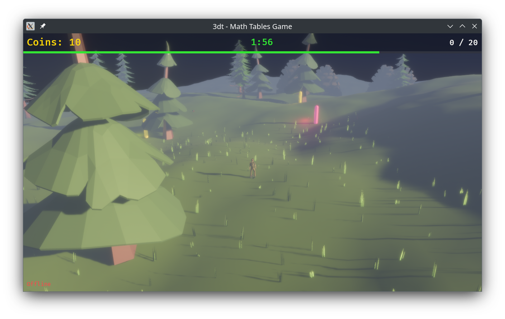
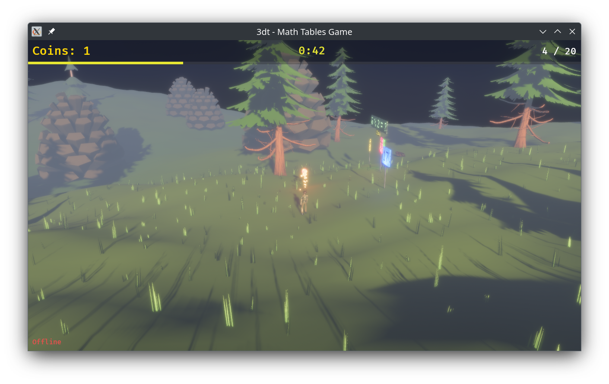

# Tafels - 3D Math Tables Game

A 3D educational game that teaches multiplication and division tables through an immersive alpine landscape. Walk through the terrain, find glowing question beacons, and throw balls at the correct answers to earn coins.

**[Play now in your browser](https://kervel.github.io/tafels/)** (single-player — some graphical effects like shadows and atmospheric scattering are disabled in the web version due to current Bevy WebGPU limitations)





## Features

- **3D alpine landscape** with procedurally generated terrain, trees, grass, and atmospheric lighting
- **Multiplication & division exercises** with three difficulty levels (easy / medium / hard)
- **Ball-throwing mechanic** to answer multiple-choice questions floating in the world
- **Coin-based scoring** with bonuses for fast answers
- **Real-time multiplayer** via WebSocket — race other players to answer beacons first
- **Mobile & touch support** with virtual joystick, touch camera controls, and a shoot button
- **Progressive Web App** — installable on Android and works offline after first load
- **Single-player fallback** when no server is available

## Tech Stack

- **Rust** + **Bevy 0.18** (ECS game engine)
- Compiles to **WebAssembly** (browser) and **native** (desktop)
- **Axum** WebSocket server for multiplayer
- **Postcard** binary serialization for network messages

## Project Structure

```
client/   — Bevy game client (WASM + native)
server/   — Axum multiplayer server
shared/   — Common types, protocol, exercise generation
charts/   — Helm chart for Kubernetes deployment
```

## Running Locally

```bash
# Start the server
cargo run -p tafels-server

# Run the native client
cargo run -p tafels-client

# Or build the WASM client with Trunk
cd client && trunk serve
```

## Multiplayer Server

The GitHub Pages version runs in single-player mode. For multiplayer, you need to deploy the game server. It serves both the WASM client and the WebSocket endpoint.

### Deploying with Helm

A Helm chart is provided in `charts/tafels-helm/` for deploying to Kubernetes.

```bash
helm install tafels oci://ghcr.io/kervel/charts/tafels-helm \
  --set ingress.domain=tafels.example.com
```

Key values:

| Parameter | Default | Description |
|---|---|---|
| `server.image.repository` | `ghcr.io/kervel/tafels-server` | Server container image |
| `server.image.tag` | `null` | Image tag |
| `ingress.domain` | `tafels.example.com` | Hostname for the ingress |
| `ingress.className` | `nginx` | Ingress class |
| `ingress.tlsIssuer` | `""` | cert-manager issuer (enables TLS when set) |

See `charts/tafels-helm/values.yaml` for all available options.

## Credits

- Character model — [CesiumMan](https://github.com/KhronosGroup/glTF-Sample-Assets) (CC0, KhronosGroup)
- Tree model — [Pine Tree 01](https://polyhaven.com/a/pine_tree_01) (CC0, Poly Haven)
